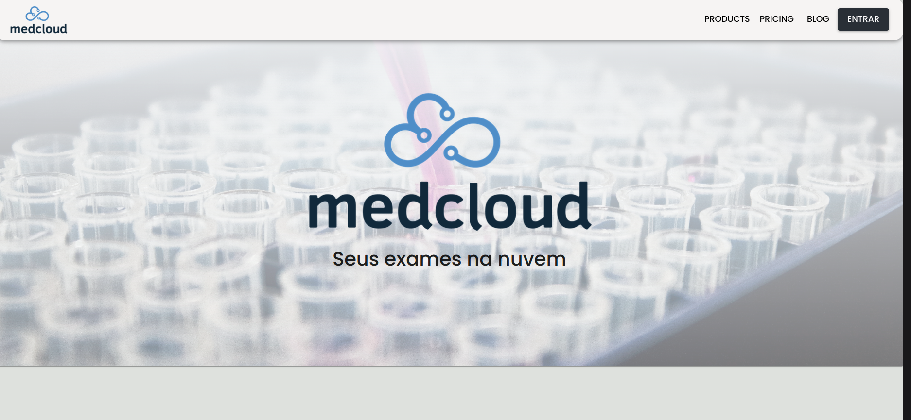
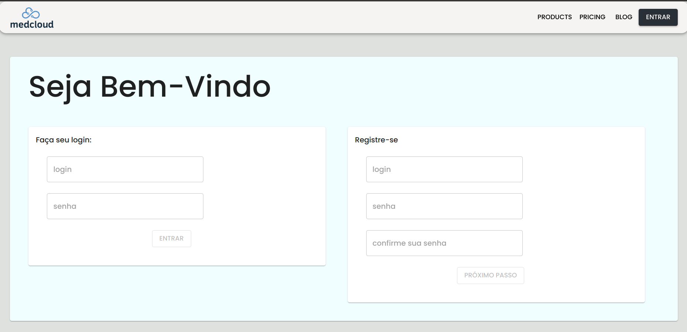
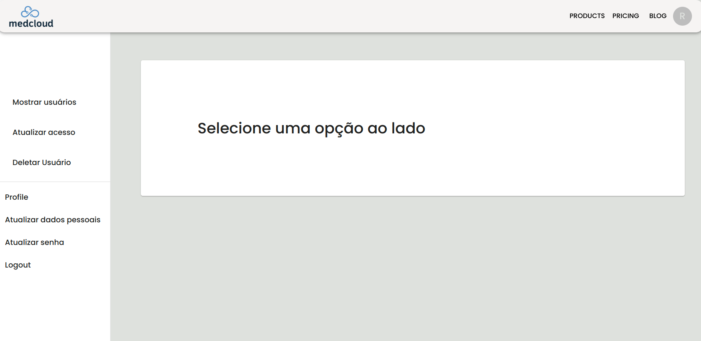
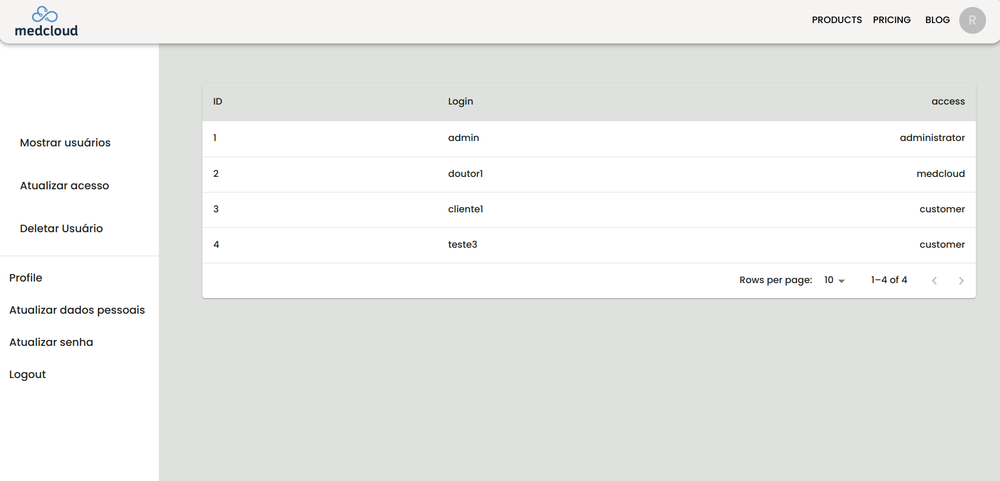
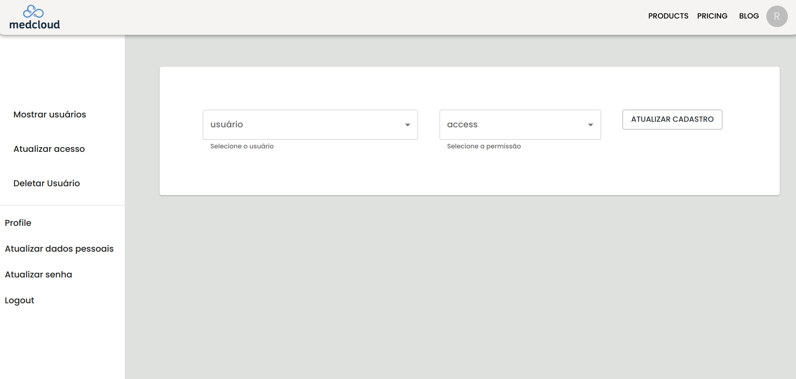
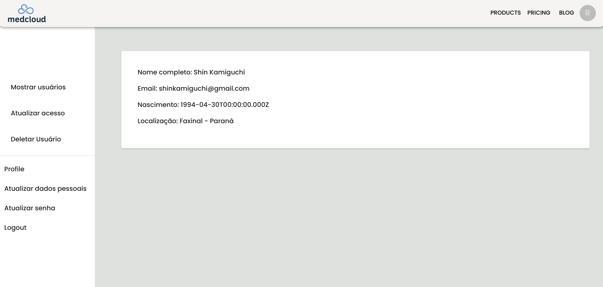

# Bem vindos ao serviço de cadastro de novos usuários

### Observações:
 - O banco de dados utilizado foi o AWS RDS - MySql;
 - A app está na EC2 rodando através do pm2 - http://54.94.1.161:3001;
 - O front está localmente - Fiz o deploy da aplicação no vercel, mas por questões de segurança, e por problemas na conexão com o app sem SSL optei por retirar do ar. Para executar é necessário o npm start na pasta de frontEnd.
 - Foi utilizado o React e Material Ui para o FrontEnd;
 - Node.js e express para Backend;

## Backend

  - Para o banco de dados foi criado 3 tipos de usuários: customer, medcloud e administrator;
  - Cada um tem permissões e restrições, baseado no token recebido ao realizar o login;
  - Para cada usuário, além do cadastro de login, cada um possui 2 tabelas de informações, um com dado pessoal e outro com dados médicos;
  - A senha é armazenada criptografada;
  
  ### Restrições
   - Usuários: grupo maior, todos as funções (adm, medcloud e customer) estão nesse grupo:
        - Create - Criar um novo login e dados pessoais;
        - Read - Ver seus dados pessoais;
        - Update - Atualizar a senha do usuário
      - Administrator: 
        - Read - ler todos usuários cadastrados;
        - Update - Pode atribuir novas funções para o usuário cadastrado;
        - Deletar usuários;
      - Medical: São os funcionários da empresa
        - Create - Criar dados médicos do usuário;
        - Read - ler os dados médicos e pessoais do usuário;
        - Update - Atualizar dados médicos do usuários
        - Delete - Deletar dados médicos do usuário;
      - Customer: Clientes - mais restritos;
        - Read - Ler seus dados pessoais e médicos;
        - Update - Atualizar sua senha

  ### Tabelas

    users
   | id | login | password | access |
   |---|---|---|---|
   | 1 | admin | adminMedCloud | administrator |
   | 2 | doutor1 | doutorMedCloud | medcloud |
   | 3 | cliente1 | clienteMedCloud | customer |

   
    personalData
   | id | firstName | lastName | email | brithDate | city | state | userId |
   |---|---|---|---|---|---|---|---|
   | 1 | Victor | Kamiguchi | email@email.com | 1994-01-01 | Londrina | Paraná | 1|

   medicalData
   | id | weight | height | observations | userId |
   |---|---|---|---|---|
   | 1 | 80 | 170 | hipertenso, sobrebeso | 1|

## FrontEnd

  - Para iniciar, deve se fazer o login no botão entrar na navbar;
  - De acordo com o seu acesso você vai ser redirecionado a uma página específica
  - Você só pode acessar a página se estiver com o token correto;
  - Nesse token consta os dados do seu access, permitindo ou não seu acesso;
  - Para testar, pode-se fazer o login com os 3 usuários disponíveis no banco de dados;

  ### Imagens da tela

  ;
  ;
  ;
  ;
  ;
  ;
